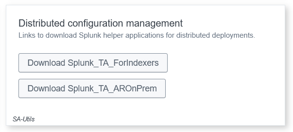
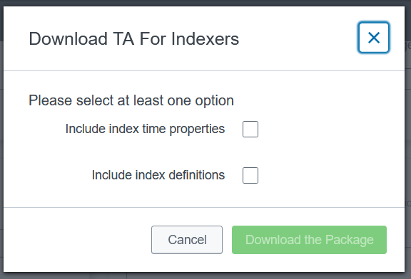

# Distributed Configuration Downloader

This directory is designed for downloading configuration items, which can be found in the Enterprise Security interface under General setting, then Distributed configuration management.





## Requirements

- Python 3.x
- Splunk Enterprise
- Splunk Enterprise Security

## Installation

1. Clone the repository:
```sh
git clone https://github.com/tsnaketech/splunk_distributed_configuration_downloader.git
```
2. Navigate to the project directory:
```sh
cd splunk_distributed_configuration_downloader
```
3. Install the required dependencies:
```sh
pip install -r requirements.txt
```

## Usage

1. Configure the settings in `.env` file or in `.conf`,`.ini`,`.yaml`,`.yml` configuration file to match your environment.
2. Run the downloader script:
```sh
python splunk_distributed_configuration_downloader --config config.yaml
```

### Arguments

- `--config`,`-c`: Path to the configuration file .ini, .conf, .yaml or .yml.
- `--scheme`,`-S`: Splunk scheme. Choices are `http`, `https`. (Optional with --config)
- `--host`,`-H`: Splunk host. (Optional with --config)
- `--port`,`-P`: Splunk port. (Optional with --config)
- `--token`,`-t`: Splunk authentication token. (Optional with --config)
- `--username`,`-U`: Splunk username. If you need test your configuration file. (Optional with --config)
- `--routine`,`-r`: Routine to execute. Choices are `index_time_properties`, `on_prem`. (Optional with --config)
- `--indexes`,`-i`: Index to include from all apps. (Optional with --config)
- `--properties`,`-p`: Properties to include from all apps. (Optional with --config)
- `--output`,`-o`: Output directory. (Optional with --config)
- `--extension`,`-e`: Extension for the downloaded file. Choices are `spl`, `tar.gz`, `tgz`. (Optional with --config)
- `--verify`,`-v`: Verify the configuration file. (Optional with --config)

## Configuration

Sample configuration files are available with a `.sample` extension in `sample` folder. You can use these as a starting point for your own configuration:

- `sample\.env.sample`
- `sample\config.ini.sample`
- `sample\config.yaml.sample`

Make sure to customize these files to match your environment before running the downloader script.

## Contributing

Contributions are welcome! Please submit a pull request or open an issue to discuss your ideas.

## License

This project is licensed under the MIT License. See the [LICENSE](LICENSE) file for details.
